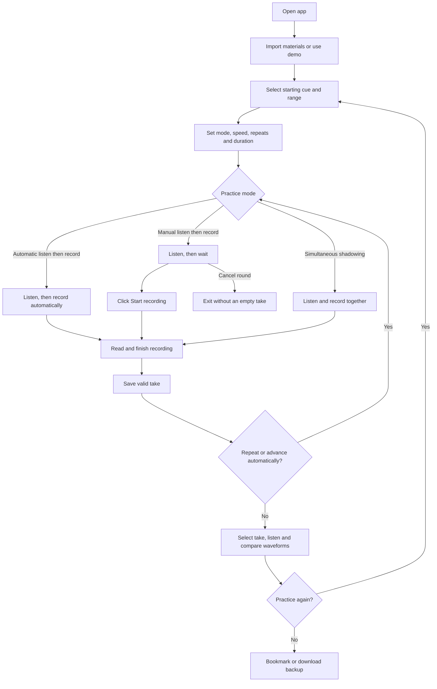

# Echo Shadowing Trainer · User Manual

[中文](Echo影子跟读-使用操作手册.md) | **English** · [README](../README.en.md)

Version: current local personal edition | Updated: 2026-10-06 | Audience: individuals practicing spoken English with video or audio

> Start with section 3. Red numbered markers identify controls; numbering restarts in each screenshot. The screenshots show the current Chinese interface, with English explanations below. Original JPGs are retained; annotated SVGs embed the original image. Material names and positions are demonstration data. Recording/waveform examples use synthetic test signals, not human pronunciation or real assessment results.

## Contents

1. [Product and background](#1-product-and-background)
2. [Preparation and limits](#2-preparation-and-limits)
3. [Complete your first practice](#3-complete-your-first-practice)
4. [Import and switch materials](#4-import-and-switch-materials)
5. [Select cues and custom ranges](#5-select-cues-and-custom-ranges)
6. [Modes and recording settings](#6-modes-and-recording-settings)
7. [Playback and waveform comparison](#7-playback-and-waveform-comparison)
8. [Edit subtitles and timing](#8-edit-subtitles-and-timing)
9. [Review bookmarks and export records](#9-review-bookmarks-and-export-records)
10. [Download, delete and restore](#10-download-delete-and-restore)
11. [Optional pronunciation assessment](#11-optional-pronunciation-assessment)
12. [Storage and backups](#12-storage-and-backups)
13. [Troubleshooting](#13-troubleshooting)
14. [Suggested daily routine](#14-suggested-daily-routine)

## 1. Product and background

### 1.1 Why Echo exists

Repeatedly dragging the timeline and finding the next sentence interrupts speaking practice. Without recording playback and a reference comparison, it is also difficult to notice differences in pauses, duration and delivery.

Echo turns timed subtitles into practice units: listen to a source, record your reading, listen back, compare and try again. Multi-sentence/custom groups support connected speech. Manual recording gives you preparation time after listening.

### 1.2 Features and scope

- Import local video/audio with SRT/VTT subtitles.
- Select one cue, preset groups or a custom consecutive cue count; adjust speed and repeats.
- Use automatic listen-then-record, manual listen-then-record or simultaneous shadowing; save/download takes.
- Display the take's waveform and request a source waveform to compare duration, pauses and amplitude.
- Edit subtitles, bookmark sentences, download materials and use a recycle bin.
- Submit a take for optional assessment after configuring a speech service.

There is no account or cross-device synchronization, automatic transcription of existing media, article alignment to existing media or video-site URL downloading. Article imports can generate narrated audio and matching SRT. Waveforms are not pronunciation scores and are not aligned word by word.

### 1.3 Page layout

The player, active unit, practice controls and recording history are on the left; transcript and feedback are on the right. **导入素材** (Import materials) includes the material library. **复习** (Review) opens bookmarked sentences. Small screens stack these areas.


*Figure 1: ① select the starting cue → ② check the group; ③ bookmark for review; ④ edit the first cue. Section 5 shows the custom-count input.*

## 2. Preparation and limits

1. Open the running [local app](http://127.0.0.1:4173/). If unavailable, confirm the service is running. “localhost” refers to the current device; a phone's localhost does not access your computer.
2. Prepare a microphone and preferably headphones to reduce source audio leakage.
3. Allow this site's microphone access when prompted, and check the selected operating-system input device.
4. Prepare matching media/subtitle versions, or start with the built-in eight-cue demo. It uses synthesized speech and a static cover, not a real video interview.

| Item | Current rule |
| --- | --- |
| Import file size | No application-imposed cap; browser storage, memory, device and codecs still matter |
| Subtitle scale | No cue-count, per-cue text-length or total-duration cap; 100 cues per page |
| Media | Browser-decodable MP4, WebM, MP3, WAV, M4A, etc.; H.264/AAC is a practical MP4 choice |
| Subtitles | SRT/VTT with valid start/end times, non-overlapping ranges and non-empty text |
| One recording | Maximum 5 minutes; about 0.3 seconds minimum to save; speak for at least half a second in practice |
| Cloud assessment | Maximum 30 seconds and 2,000 reference characters; American English (`en-US`) |
| Recording environment | Localhost or HTTPS secure context and microphone permission |
| Data location | Current browser only; no account synchronization |

**Uncapped imports do not mean unlimited device capacity. The 5-minute recording cap and 30-second assessment cap are separate.**

## 3. Complete your first practice

### 3.1 Main workflow



Every manual round waits for an explicit click. Repeats/automatic progression may continue practicing first; finish or stop before reviewing. Pronunciation assessment is optional.

### 3.2 First session, step by step

1. Click a cue in the right transcript and check its text on the left.
2. Under **练习范围** (Practice range), choose **单句练习** (Single sentence) or the desired group size.
3. Expand **练习设置** (Practice settings). Under **练习模式** (Mode), choose **先听后手动录音：准备好后点击开始** (Listen, then manually start recording when ready).
4. Turn off **循环播放** (Repeat) for a single first attempt.
5. Click **开始跟读** (Start practice) and listen.
6. When the main button becomes **开始录音** (Start recording), prepare and click it, then read aloud.
7. Click **结束录音** (Finish recording), or let the set duration end and save.
8. Listen in **本句／本组练习记录** (This sentence/group's recordings). Click **对比原声** (Compare source) for waveforms, then choose one issue to practice again.

**播放原声 (Play source) only previews audio; it does not start the listen/record workflow. Finishing a recording saves a valid take. Cancelling while waiting does not create an empty take.**

## 4. Import and switch materials

### 4.1 Import files

1. Click **导入素材** (Import materials) at the top.
2. Click **选择视频或音频** (Choose video or audio) and select a local file.
3. Click **选择字幕文件** (Choose subtitle file) and select matching SRT/VTT.
4. Optionally enter a title; otherwise the filename is used.
5. Click **导入并开始练习** (Import and start practicing), then wait for reading/storage to finish.
6. Preview one cue and check sound, text and boundaries.


*Figure 2: ① choose media → ② choose subtitles → ③ name → ⑤ import; ④ paste timed subtitles instead. ⑥ switch material, ⑦ download original media, ⑧ export current subtitles.*

Without a subtitle file, expand **没有字幕文件？粘贴 SRT / VTT 内容** (No subtitle file? Paste SRT/VTT) and paste timed content:

```srt
1
00:00:01,000 --> 00:00:04,000
Small steps make a big difference.
小小的进步也能带来巨大的改变。
```

Plain English paragraphs cannot replace SRT/VTT. In bilingual subtitles, English is the practice reference and Chinese is the translation.

### 4.2 Switch materials

Finish the active round, open Import materials and click a title under **我的素材** (My materials). Check the selected cue and range again.

Subtitles extending beyond media duration are retained with a warning. Partly out-of-range units play only available media; units starting beyond the end cannot be practiced. Check that versions match.

## 5. Select cues and custom ranges


**Follow the markers: ③ select starting cue → ① choose Custom → ② enter consecutive cue count → ④ start practice. ⑤ expands mode/settings. This screenshot is at the last cue, so requesting four cues yields only the one remaining cue.**

1. Click a transcript cue to select the starting position. Scrubbing the player while paused also selects the corresponding cue.
2. Choose a single cue or a 2/3/5/10-cue group in Practice range.
3. For another count, choose **自定义** (Custom) and enter a positive integer in **连续句数** (Consecutive sentences), such as 4 or 12.
4. Check **当前句组 X–Y** (Current group X–Y) and the merged text.
5. **上一组／下一组** (Previous/Next group) moves by the selected count. Near the end, only remaining cues are used.

Custom range means consecutive cues from the selected start, not arbitrary separate cues or manually entered seconds. Pauses are retained; recording, repeats and progression apply to the group. Custom non-preset counts persist across reloads.

During continuous playback, the current group and full text stay stable until its last cue ends. Player captions may follow individual cues. Explicit selection still takes effect immediately.

Single-cue and group recordings are shown separately. A take disappearing after changing ranges does not mean deletion: return to its recorded start and count.

Use **上一页／下一页** (Previous/Next page) for long transcripts, or enter a cue number in **跳转到第几句** (Jump to cue) and click **跳转** (Jump). Changing pages alone does not select a new cue.


*Figure 3: ①/② change page; ③ enter cue number → ④ jump; ⑤ click a cue. Next page is normally disabled on the final page.*

## 6. Modes and recording settings

### 6.1 Three modes

| Mode | After Start practice | Typical use |
| --- | --- | --- |
| 先听后读：听完再录音 — Automatic listen-then-record | Recording starts automatically when source playback ends | Familiar text and continuous practice |
| 先听后手动录音 — Manual listen-then-record | Waits after listening; click Start recording | Understanding, preparation or breathing time |
| 同步跟读：边听边录音 — Simultaneous shadowing | Records during source playback | Connected rhythm imitation; use headphones |


*Figure 4: ① expand settings → ② choose mode; ③ repeats, ④ recording duration, ⑤ automatic progression; ⑥ start round.*

Each manual round waits indefinitely for your click. **取消本轮练习** (Cancel round) exits the waiting stage without an empty recording. Range, speed and related controls are locked during practice; change them after finishing.

### 6.2 Adjust intensity

- **Playback speed:** 0.6/0.8/1.0/1.2x. Slow down to hear details, then return to normal speed.
- **Repeat:** with looping enabled, repeat 1/2/3/5 times; disabled means one round.
- **Automatic next cue/group:** continues after all repeats of the current unit. Manual mode still waits for recording input every time.
- **Recording duration:** both listen modes support automatic, at least 30 seconds, at least 1 minute, at least 2 minutes or 5 minutes. Automatic uses reference duration at practice speed plus about 1.2 seconds. “At least” may extend for a longer reference, up to 5 minutes.
- **Simultaneous shadowing:** usually stops with the reference. The duration control does not extend shadow recordings.

Recording status shows elapsed/expected time and microphone level. Finish recording saves early. Wait during saving; avoid closing or refreshing. In preparation, listening or interval stages, the main button stops the round.


*Figure 5: ⑥ is the main action. This image shows idle settings; it becomes Start recording while waiting and Finish recording while recording. The development diagnostic recording screenshot was removed from the manual.*

## 7. Playback and waveform comparison

### 7.1 Locate the right take

1. Return to the material, starting cue and range used for the recording.
2. Select a take under the current sentence/group's recordings.
3. Check its timestamp, duration and **原声 XX:XX–XX:XX** (Source range). Older takes may lack saved reference bounds.
4. Use its audio player, or click **原声 → 我的录音** (Source → My recording) for sequential playback.

Old takes retain capture-time text, bounds and speed after edits. If text/timing-change warnings appear, verify the intended take before comparison.

### 7.2 View waveforms

1. Selecting a take automatically shows **我的录音** (My recording) first.
2. Click Compare source and wait for silent sampling progress.
3. The source waveform appears below, sharing time/amplitude scales.
4. **取消采样** (Cancel sampling) stops processing. Failure/cancellation preserves your waveform.
5. **重新对比原声** (Compare source again) recalculates when needed.


*Figure 6: ① sequential playback, ② compare source; ③ recording waveform, ④ source waveform, ⑤ shared time scale; ⑥ play take, ⑦ download, ⑧ remove. The recording is synthetic test audio, not a pronunciation example.*

The source is sampled silently at 1.0x; displayed time is adjusted to the captured practice speed. Processing takes roughly the original range duration. The entire source is not read and decoded into memory; only the selected range contributes to waveform statistics.

**What to inspect:** sound onset/end, long pauses, unusually short recordings or low volume. Blank space after a shorter track is the remainder of the shared axis and is not necessarily a capture failure. Time zero is the selected range start, not the whole material start.

**Interpretation:** amplitude alone does not establish stress or speaking ability. Waveforms cannot establish phoneme accuracy. Speed-adjusted source timing is not a sample-exact copy of slowed audio; there is no word alignment or similarity score. Background music and other voices also appear in the source waveform.

## 8. Edit subtitles and timing

1. Select the cue and finish active practice.
2. Click the sliders icon **修改字幕和时间轴** (Edit subtitles and timeline); in group mode, it edits the first cue.
3. Enter start/end seconds, allowing decimals. End must follow start; neighboring cues must not overlap.
4. Edit English and optional Chinese translation, then **保存修改** (Save changes).
5. Preview the boundaries and record a new take.


*Figure 7: ① start seconds, ② end seconds, ③ English, ④ translation → ⑤ save. Group editing modifies only its first cue.*

The eye icon hides/restores subtitles for listening practice. If entire versions differ, editing individual cues may be insufficient; import the matching version. Original subtitle download preserves the imported file; current subtitle export uses edited timings/text.

## 9. Review bookmarks and export records

1. Click the bookmark icon beside the current cue.
2. Open Review at the top.
3. Click a row or **去练习** (Go to practice), then check the range before recording again.
4. Remove a review mark when no longer needed; this removes only the bookmark.
5. With practice records present, use **导出练习记录** (Export practice records) to download JSON.


*Figure 8: ① open Review, ③ go to practice; ④ remove bookmark, ② export metadata. Export is disabled without recordings.*

A group bookmark marks its **first cue**, not the whole group. Check the count when returning. JSON contains metadata and existing assessments, no audio; it is not a fully restorable backup. JSON import/restore is not implemented.

## 10. Download, delete and restore

### 10.1 Download files

| Item | Entry point | Contents |
| --- | --- | --- |
| Original media | Import materials → My materials → Download original audio/video | Imported file with original filename |
| Original subtitles | Material row → Download original subtitles | Imported SRT/VTT, if retained |
| Edited subtitles | Material row → Export current subtitles | Current text, translation and timings as SRT |
| One take | Download icon in recording row | WAV audio |
| Practice metadata | Review → Export practice records | JSON without audio |

Confirm completion in browser downloads. Older imports may lack original subtitles; export current subtitles instead. Current export is not a byte-for-byte original backup.

### 10.2 Material recycle bin

1. Click **删除素材** (Delete material) in My materials.
2. Check name/scope, then **确认移入回收站** (Confirm move to recycle bin).
3. The material and related takes, assessments and review marks are hidden.
4. **恢复** (Restore) brings the material and related records back.
5. Download needed files before permanent deletion, then confirm its scope.


*Figure 9: ① move to bin; ② restore, ③ request permanent deletion; ④ cancel, ⑤ confirm. This historical screenshot shows an obsolete “200MB maximum” banner. Current imports have no application-imposed size cap.*

**The bin still occupies storage. Permanent deletion removes media, original subtitles, edits, related recordings, assessments and review marks irreversibly. The built-in demo cannot be deleted.**

### 10.3 Delete one take

Click **移除录音** (Remove recording) in its row and confirm. Download its WAV first if needed. Individual take deletion **cannot be restored from the material recycle bin**.

## 11. Optional pronunciation assessment

Local playback, recording, waveforms and review need no service. “Not assessed” does not mean zero points.

1. Click **开启语音评测** (Enable speech assessment) in feedback and read status/configuration instructions. Some versions also expose practice/assessment settings at the top.
2. A maintainer creates an Azure Speech resource, copies `.env.example` to `.env` in the project root, sets `AZURE_SPEECH_KEY` and `AZURE_SPEECH_REGION`, then restarts the service.
3. Check connection status. Keys belong on the backend, not in subtitles or `VITE_` variables.
4. Select a valid take no longer than 30 seconds with no more than 2,000 English reference characters; click Assess this recording.
5. Inspect returned accuracy, fluency, completeness and, when available, prosody and word/phoneme results. Pick one word to listen to and practice.

**Assessment sends the selected take and captured English reference to Azure Speech and may incur charges.** Imports/local practice do not assess automatically. Long takes remain saved and playable; use a shorter unit for assessment.

This evaluates reading against a reference, not voice similarity, and does not replace human judgment. Real paid service has not been validated end to end with actual credentials; mocked interface tests are not a service guarantee. Public deployments need protected access. Static hosting alone does not provide the assessment backend.

## 12. Storage and backups

Materials, recordings and review information are stored in the current browser, with preferences/position also local. Successful saves normally survive reloads.

**Different browsers, profiles and website addresses may have separate storage.** `localhost:4173` and `127.0.0.1:4173` are different origins; records are not shared automatically. Use a consistent address.

Clearing site data, private browsing, browser storage eviction, profile deletion or changing devices can lose records. There is no account/cloud backup.

Backup order: original media → original/current subtitles → important WAV takes → JSON metadata. When sharing this Markdown manual, include the adjacent `manual-assets` folder so screenshots display.

## 13. Troubleshooting

| Symptom | Check first | Action |
| --- | --- | --- |
| Page unavailable | Address and running service | Use the original address; ask the maintainer to check the service. Do not clear data just because access temporarily fails |
| Microphone unavailable | Site permission, input device, HTTPS/localhost | Allow access, choose correct input, close conflicting apps and retry |
| No recording after manual listening | Main button says Start recording | Expected waiting state; click to record or cancel |
| Take too short/quiet | At least half a second of speech and correct input | Record again; check input level and microphone placement |
| Latest take missing | Material, start and single/group range | Return to capture-time range; automatic progression may have selected the next group |
| Wrong-looking reference range | Saved range versus current subtitles | Check capture-time text/bounds; editing does not rewrite old takes |
| Subtitles exceed duration | Matching versions | Import matching subtitles or edit timing; wholly out-of-range cues have no source playback |
| Sound at start but empty waveform | Updated app, correct take, successful sampling | Reload/recompare and check bounds; preserve codec, cue number and exact times for diagnosis |
| Slow comparison/buffering | Range length and browser playback | Processing roughly follows original duration; cancel, use shorter groups and close unrelated tabs |
| Out of Memory/storage failure | Material size, free memory/site storage | Download backups, then remove unneeded data. Moving to bin does not free space; confirm backups before purge |
| Media will not play | Supported encoding | Reimport with common codecs or test MP3/WAV first |
| No original subtitle download | Older import | Export current subtitles; an unretained original cannot be reconstructed |
| Missing scores/assessment failure | Service, duration/text limits, volume | Continue locally; have maintainer check service and retry a shorter take |

## 14. Suggested daily routine

1. Choose a short complete group, listen in manual mode and understand it before speaking.
2. Record once and listen for omissions, pauses and rhythm; choose one issue.
3. Bookmark difficult cues and slow to 0.8x if needed; return to 1.0x after improvement.
4. Increase group size once individual cues are stable; try simultaneous shadowing.
5. Download useful recordings before finishing; continue from Review next time.

### Documentation evidence

Based on the current local code/interface as of 2026-10-06. Import, subtitle-editor and review screenshots were recaptured for the Chinese manual; range, mode, waveform, pagination and recycle-bin images reuse saved project evidence. Captions explain their purpose. Device permissions, microphone results and paid service behavior depend on the actual environment.

Both manuals share the workflow and nine numbered annotated screenshots, referenced ten times. Original JPGs were not overwritten. The English edition translates instructions/captions; Chinese screenshot controls and embedded annotations remain unchanged so they match the app.

## Article to speech and subtitles

In Import materials, expand “文章转语音 + 自动生成 SRT” (Article to speech + SRT), paste an article or import a UTF-8 TXT file, choose a voice, and click “生成并导入练习” (Generate and import). Third-party open-source edge-tts calls Microsoft's online speech service, not a Microsoft open-source offline engine. No Azure key is required. Generation requires a network connection and sends article content to Microsoft. Generated audio is stored in the browser for offline replay.

Audio is generated by sentence. Cue times use actual decoded audio lengths with 0.25-second gaps. This does not align articles to existing videos. Rule-based segmentation may need review for complex abbreviations and punctuation. There is no total article character cap; long sentences are split into requests. Progress and cancellation are available. Failure imports no partial lesson and retains the input to retry. Browser memory/storage and WAV's 32-bit capacity limit extremely long output.

Download the original article, generated audio, original SRT or edited SRT. These files follow the lesson into the recycle bin. Existing groups, repeats, automatic progression and manual recording apply. Local recording supports five minutes. Cloud pronunciation assessment remains English-only and limited to 30 seconds; synthesized speech never supplies pronunciation scores.

The local backend requires Python 3.9+: run `python -m venv .venv-tts`, then `.venv-tts/Scripts/python.exe -m pip install -r server/requirements-tts.txt` on Windows, or use `.venv-tts/bin/python` elsewhere. The project environment is detected automatically; `TTS_PYTHON` in `.env` can override it. Node development, preview and production servers support synthesis. The current Sites Worker cannot execute Python and needs a separate speech backend for cloud generation. Online service changes may interrupt synthesis but do not affect saved materials.
