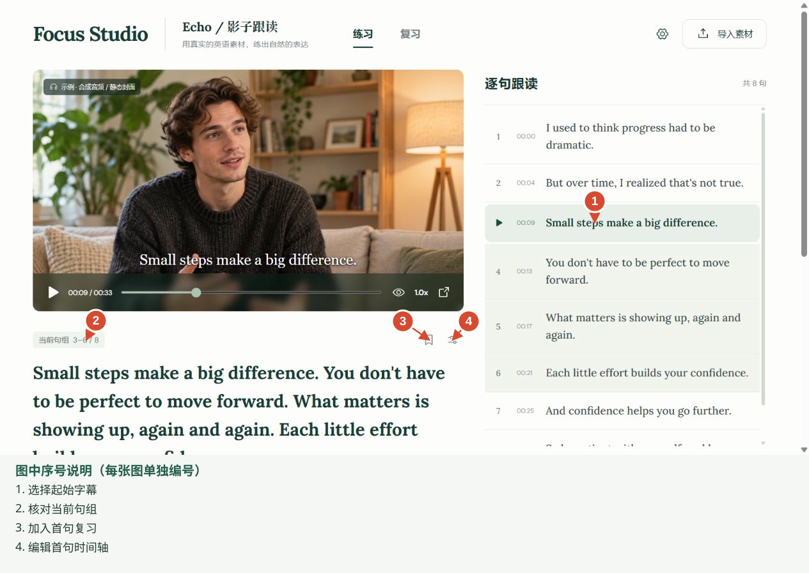
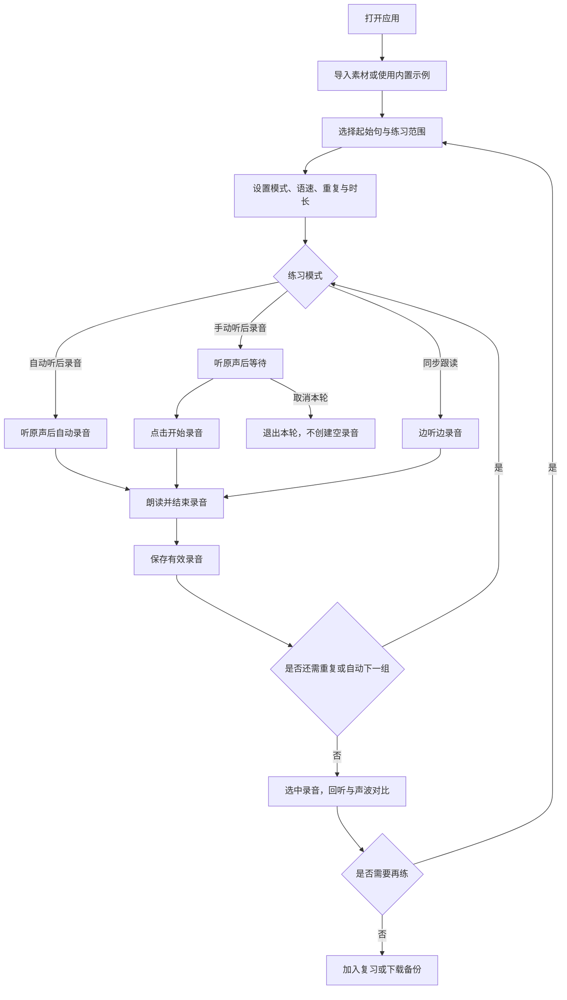
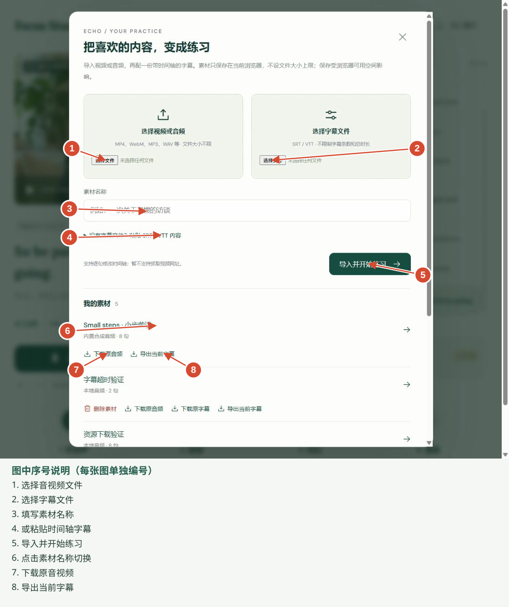
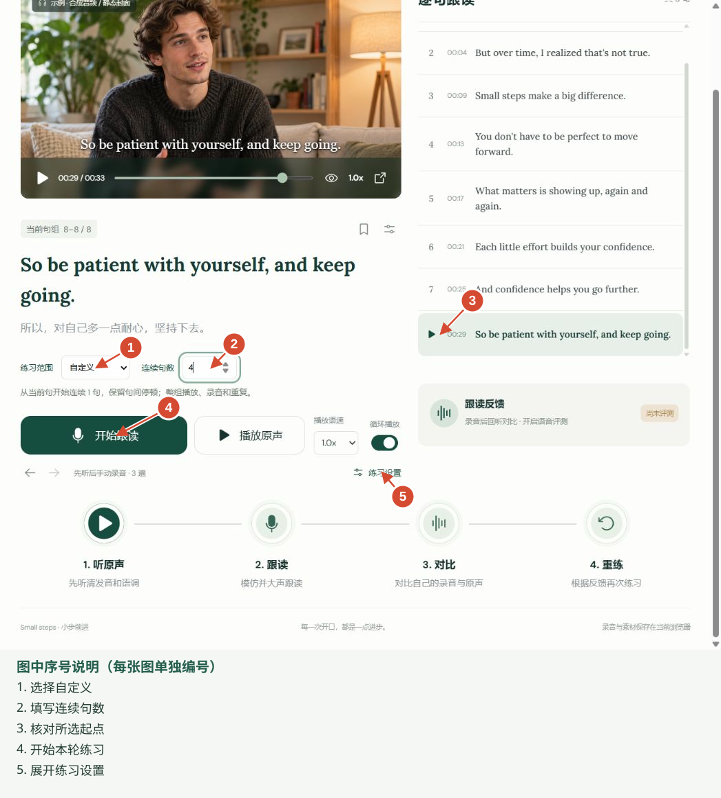
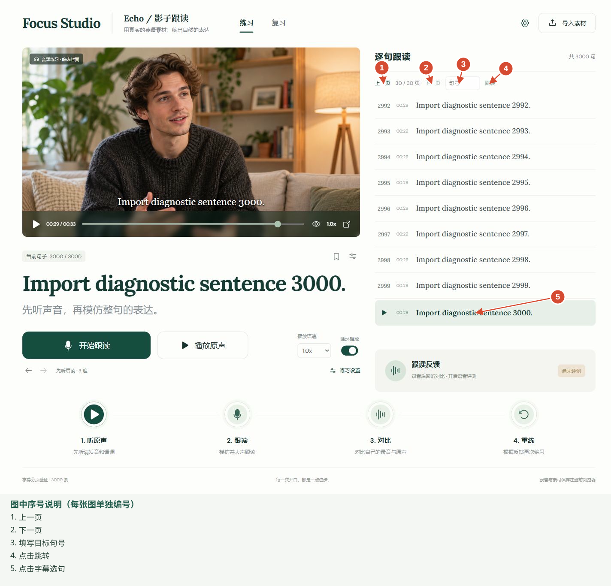
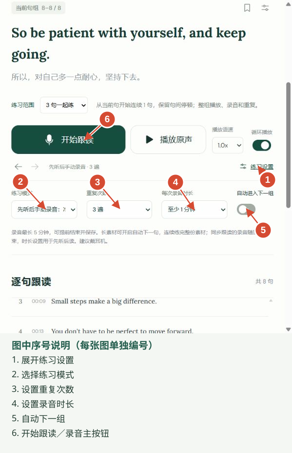
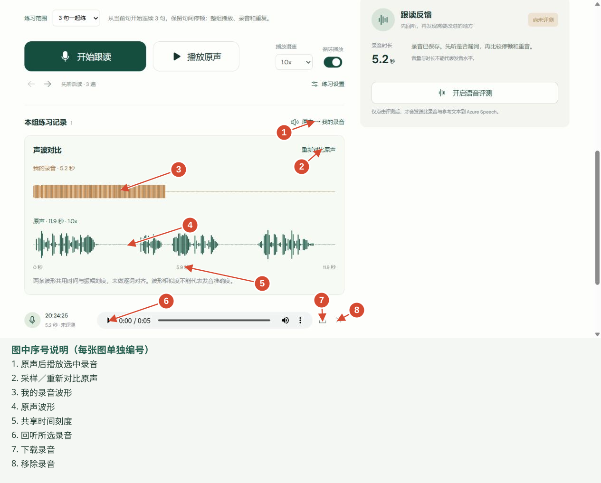
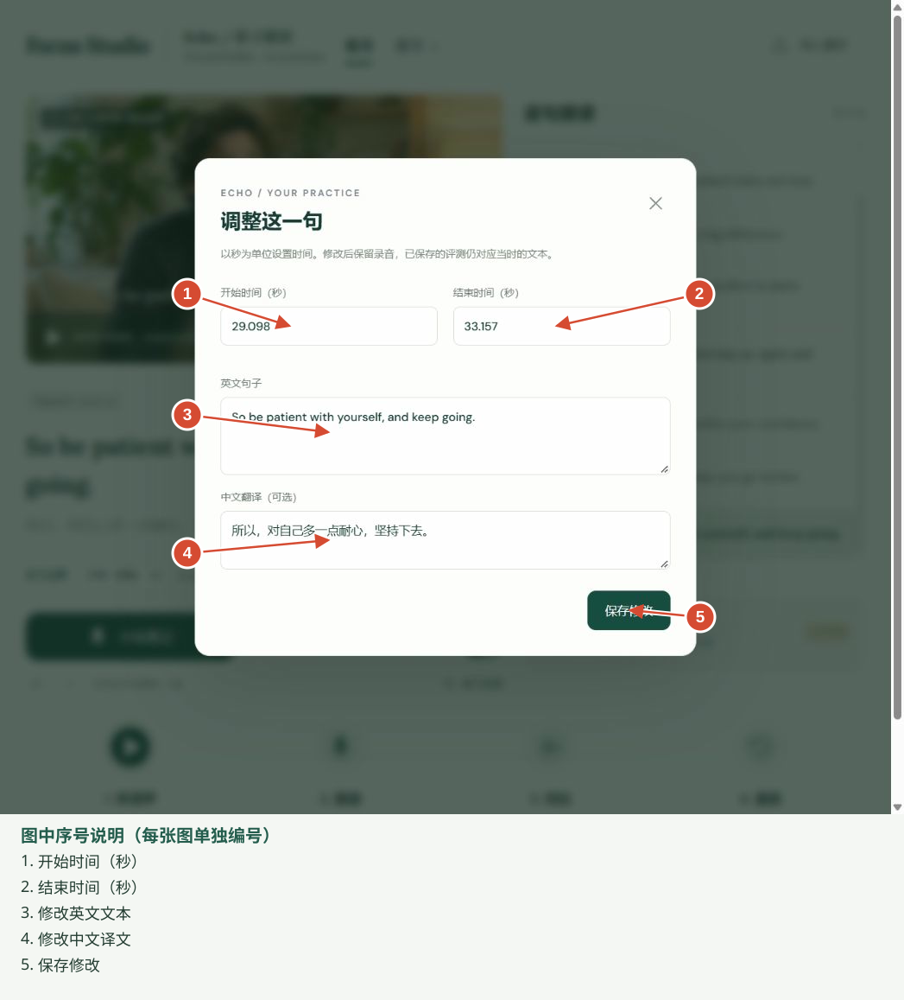
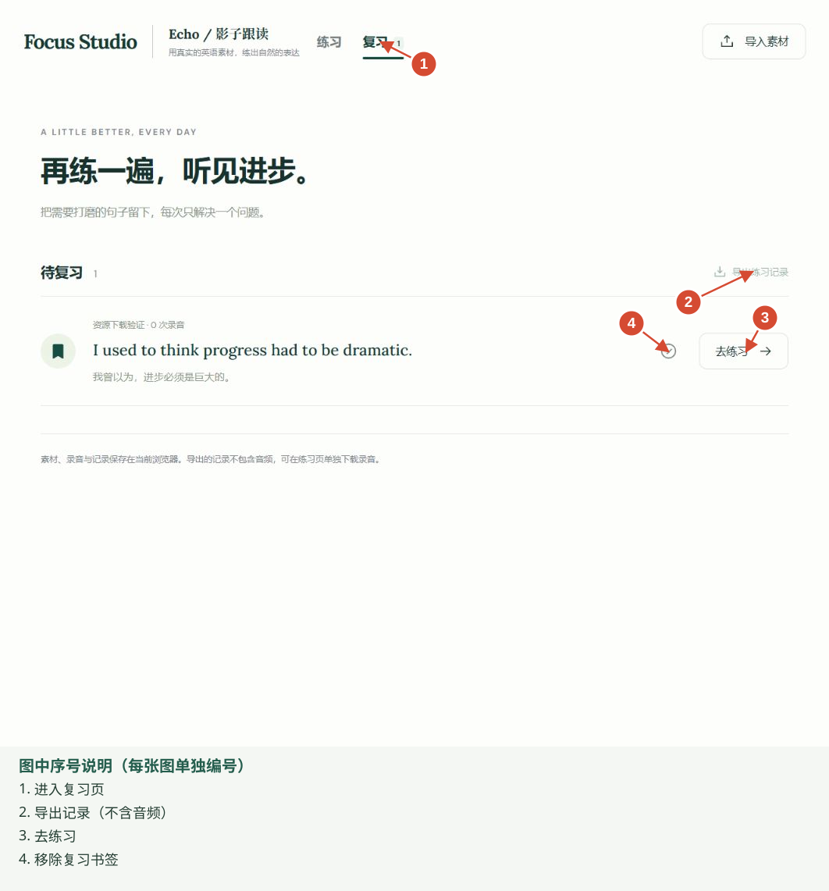
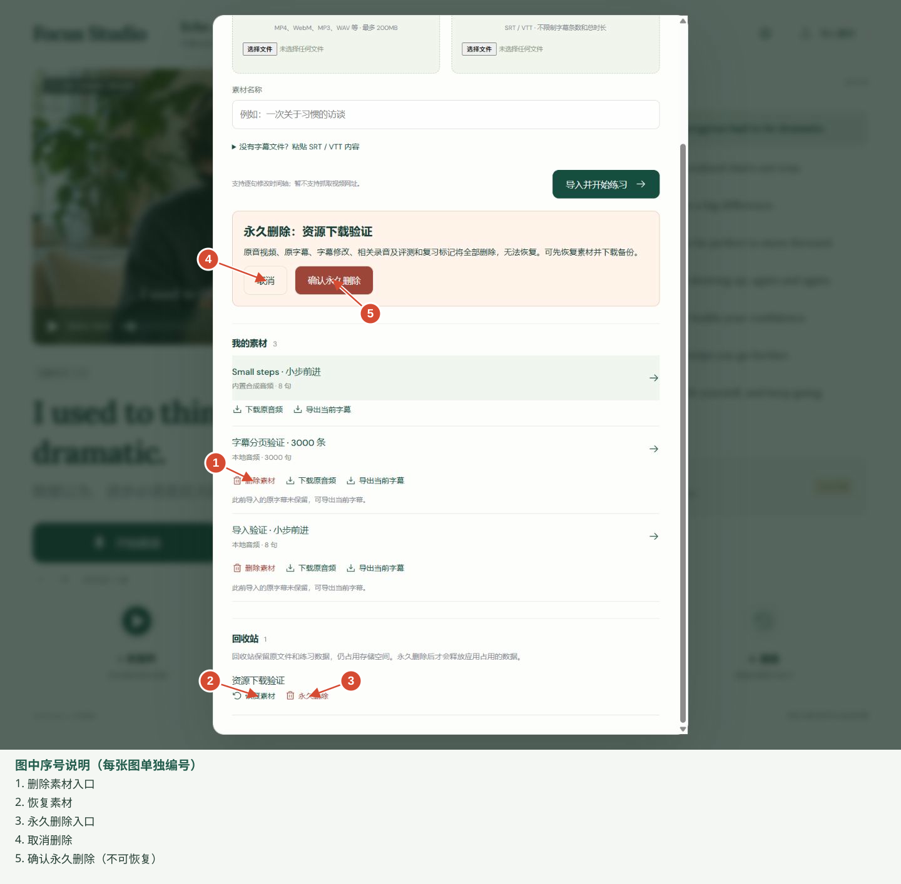

# Echo 影子跟读 · 使用操作手册

**中文** | [English](Echo-User-Manual.en.md) · [返回 README](../README.md)

版本：当前本地个人版｜更新日期：2026-10-06｜适用对象：使用视频或音频练习英语口语的个人用户

> 阅读方式：第一次使用先看第 3 节；需要具体操作时按目录查找。图中红色序号指向具体控件，图下提供同号说明；每张图重新从 1 编号。原截图保留在图片目录，SVG 标注图内嵌原图，可独立显示。截图中的素材名称与练习位置是演示数据，与你的实际内容可能不同。录音、声波示例来自合成测试信号，不能作为真人发音或评测结果。

## 目录

1. [产品介绍与开发背景](#1-产品介绍与开发背景)
2. [使用前准备与关键限制](#2-使用前准备与关键限制)
3. [快速完成一次练习](#3-快速完成一次练习)
4. [导入与切换素材](#4-导入与切换素材)
5. [选择句段与自定义练习范围](#5-选择句段与自定义练习范围)
6. [练习模式与录音设置](#6-练习模式与录音设置)
7. [回听录音与声波对比](#7-回听录音与声波对比)
8. [字幕与时间轴调整](#8-字幕与时间轴调整)
9. [书签复习与练习记录导出](#9-书签复习与练习记录导出)
10. [下载删除与恢复](#10-下载删除与恢复)
11. [可选发音评测](#11-可选发音评测)
12. [数据保存与备份](#12-数据保存与备份)
13. [常见问题与处理步骤](#13-常见问题与处理步骤)
14. [建议的日常练习流程](#14-建议的日常练习流程)

## 1. 产品介绍与开发背景

### 1.1 为什么开发

跟着英语视频朗读时，反复拖动时间条、寻找下一句会打断练习。录音之后，如果没有原声回听与直观对比，也难以发现停顿、时长和表达上的差异。

Echo 把带时间轴的字幕转为练习单元，让你围绕同一句或同一组句子完成“听原声 → 朗读录音 → 回听对比 → 重练”。多句与自定义范围用于练习连贯表达；手动录音模式让你听完后有时间准备。

### 1.2 可以做什么

- 导入本地视频／音频和 SRT／VTT 字幕。
- 选择单句、预设多句或自定义连续句数，调节语速与重复次数。
- 自动听后录音、手动听后录音、同步跟读；保存与下载录音。
- 展示录音波形，按需采样原声并对比时长、停顿和振幅。
- 修改字幕、加入复习、下载素材、使用回收站。
- 配置语音服务后，主动提交录音进行发音评测。

当前没有账号／跨设备同步、从已有音视频自动识别字幕、文章与已有音视频自动对齐、视频网站链接抓取。文章入口可以生成朗读音频和对应 SRT。波形不是发音评分，也没有逐词强制对齐。

### 1.3 页面怎么读

左侧是播放器、当前句段、练习操作和录音记录；右侧是逐句字幕与反馈。顶部“导入素材”也包含素材库，顶部“复习”用于返回收藏句子。小屏幕会按顺序排列这些区域。



*图 1：①选择起始字幕 → ②核对句组；③加入复习，④编辑首句。自定义输入入口见第 5 节。*

## 2. 使用前准备与关键限制

1. 打开正在运行的 [本地应用](http://127.0.0.1:4173/)，点击首页的“开始练习”（或直接访问 `/practice`）。若无法访问，先确认应用服务已启动；“localhost”指当前电脑，不能用手机的 localhost 访问电脑服务。
2. 准备麦克风，建议佩戴耳机，减少原声被麦克风再次收录。
3. 浏览器出现麦克风权限提示时，允许当前网站访问；检查系统使用的是正确设备。
4. 准备音视频与同一版本的时间轴字幕；也可先用内置 8 句示例熟悉流程。内置内容是合成语音与静态封面，不是真人视频。

| 项目 | 当前规则 |
| --- | --- |
| 导入文件大小 | 应用不设上限；仍受浏览器存储、内存、设备和编码支持影响 |
| 字幕规模 | 不设条数、单条文本长度或总时长上限；长列表每页 100 句 |
| 音视频 | MP4、WebM、MP3、WAV、M4A 等，必须能被浏览器解码；MP4 可优先选 H.264/AAC |
| 字幕 | SRT／VTT，需有效起止时间、不重叠、非空文本 |
| 单次录音 | 最长 5 分钟；至少约 0.3 秒才能保存，建议朗读半秒以上 |
| 云评测 | 录音不超过 30 秒、参考文本不超过 2,000 字符；固定美式英语 en-US |
| 录音环境 | 需要 localhost 或 HTTPS 安全上下文及麦克风权限 |
| 数据位置 | 当前浏览器本地，没有账号同步 |

**不设导入大小限制，不等于设备能处理无限数据；5 分钟录音限制和 30 秒评测限制是两件不同的事。**

## 3. 快速完成一次练习

### 3.1 主要操作流程



手动模式的每一遍都经过“等待 → 点击开始录音”；循环／自动下一组可能先继续练习，结束或停止后再回听。发音评测是可选操作，不是主流程的必需步骤。

### 3.2 第一次操作步骤


1. 点击右侧字幕的一句，确认左侧显示正确文本。
2. 在“练习范围”选择“单句练习”或所需句数。
3. 展开“练习设置”，在“练习模式”选择 **先听后手动录音：准备好后点击开始**。
4. 首次使用可关闭“循环播放”，先完成一遍。
5. 点击“开始跟读”，听完原声。
6. 等待主按钮变成“开始录音”，准备好后点击并朗读。
7. 朗读完成后点击“结束录音”；也可等待设定时长结束并保存。
8. 在“本句／本组练习记录”中回听，点击“对比原声”查看声波，再选择一个问题重练。

**注意：只点击“播放原声”仅试听，不启动听后录音流程。录音阶段的“结束录音”会保存有效录音；等待阶段的“取消本轮练习”不会创建空录音。**

## 4. 导入与切换素材

### 4.1 导入文件

1. 点击顶部“导入素材”。
2. 点击“选择视频或音频”，选择本地文件。
3. 点击“选择字幕文件”，选择同一版本的 SRT／VTT。
4. 可填写素材名称；不填写时使用文件名。
5. 点击“导入并开始练习”，等待读取与保存完成。
6. 导入后试听一句，核对声音、文本和起止时间。



*图 2：①选音视频 → ②选字幕 → ③命名 → ⑤导入；④可改用粘贴字幕。⑥切换素材，⑦下载原音视频，⑧导出当前字幕。*

没有字幕文件时，展开“没有字幕文件？粘贴 SRT / VTT 内容”，粘贴带时间轴的内容。示例：

```srt
1
00:00:01,000 --> 00:00:04,000
Small steps make a big difference.
小小的进步也能带来巨大的改变。
```

纯英文正文不能替代 SRT／VTT。双语字幕中的英文作为练习文本，中文显示为译文。

### 4.2 切换素材

结束当前练习后，打开“导入素材”，在“我的素材”点击素材名称。切换后重新确认所选字幕和练习范围。

字幕超出素材时长时，应用保留字幕并提示；部分超出的句段只播放现有原声，起点已超出素材末尾的句子无法练习。优先核对字幕与素材是否同一版本。

## 5. 选择句段与自定义练习范围



**按图操作：③选起始句 → ①选择自定义 → ②填连续句数 → ④开始练习。⑤用于展开模式等设置。截图位于最后一句，所以输入 4 句时实际只练剩余 1 句。**

1. 点击右侧字幕，选择本次练习起点；暂停时拖动播放器进度条，也会同步选择对应句子。
2. 在“练习范围”选择单句，或 2／3／5／10 句一起练。
3. 需要其他数量时选“自定义”，在“连续句数”填写正整数，例如 4 或 12。
4. 核对“当前句组 X–Y”及合并文本，再开始。
5. 用“上一组／下一组”按当前句数移动；接近末尾时自动使用剩余句子。

自定义范围指 **从当前句开始的连续句数**，不是任意多个不连续句子或手工输入秒数。组内保留句间停顿；录音、重复与自动进入下一组均针对整组。自定义非预设句数刷新后可恢复。

连续播放时，当前句组及完整文本保持到组内最后一句播放结束后才更新，播放器字幕可按单句时间变化；手动选句仍立即生效。

单句录音和句组录音分别显示；切换范围后，原来的录音可能不出现在当前列表中，并不意味着被删除。回到录制时的起始句和句数查看。

长字幕使用“上一页／下一页”浏览，或在“跳转到第几句”输入句号后点击“跳转”。翻页本身不等于选择新句子。



*图 3：①／②翻页；③输入句号 → ④跳转；⑤点击字幕选句。最后一页的“下一页”禁用属于正常状态。*

## 6. 练习模式与录音设置

### 6.1 三种模式

| 模式 | 点击“开始跟读”之后 | 适用场景 |
| --- | --- | --- |
| 先听后读：听完再录音 | 原声结束后自动进入录音 | 已熟悉文本，连续练习 |
| 先听后手动录音 | 听完停在等待阶段；点击“开始录音”才录 | 需要理解、准备或调整呼吸 |
| 同步跟读：边听边录音 | 播放原声时同时录音 | 模仿连贯节奏，建议戴耳机 |



*图 4：①展开设置 → ②选模式；③重复次数、④录音时长、⑤自动下一组；⑥开始本轮。*

手动模式每一遍都等待点击，不会等待几秒后自动开始。等待时可以点击“取消本轮练习”；取消不会产生空录音。练习过程中范围、语速等控件会锁定，结束后再调整。

### 6.2 调节练习强度

- **播放语速**：0.6／0.8／1.0／1.2x。降低语速有助于听清，之后可回到正常速度。
- **循环播放与重复次数**：开启后按 1／2／3／5 遍重复；关闭时只练一遍。
- **自动进入下一句／组**：完成当前单元的全部重复后，继续后续单元。手动模式仍逐遍等待你开始录音。
- **每次录音时长**：两个听后录音模式均可选自动、至少 30 秒、至少 1 分钟、至少 2 分钟、5 分钟。自动按原声时长换算并留约 1.2 秒缓冲；“至少”可能因原声较长而延长，但最多 5 分钟。
- **同步跟读**：通常随原声结束；“每次录音时长”控件不用于延长同步录音。

录音状态显示已录／预计时长和麦克风音量。点击“结束录音”提前结束并保存；正在保存时等待完成，避免刷新或关闭页面。准备、听原声或间隔阶段点击主按钮会停止本轮。


*图 5：⑥为主操作按钮。此图展示未开始阶段；听后等待时变为“开始录音”，录音时变为“结束录音”。开发测试页已从操作手册中移除。*

## 7. 回听录音与声波对比

### 7.1 找到对应录音

1. 回到录制时的素材、起始句与练习范围。
2. 在“本句／本组练习记录”中点击某次记录，选中它。
3. 核对录制时间、录音时长及“原声 XX:XX–XX:XX”范围。历史记录可能未保存原声范围。
4. 使用该行播放器回听；点击“原声 → 我的录音”按顺序播放参考原声与所选录音。

修改字幕后，旧录音仍保留录制时的文本、范围和语速；出现“对应修改前的文本”或时间轴变化提示时，先核对它是否是你要比较的那次录音。

### 7.2 查看波形

1. 选中录音后，“我的录音”波形自动显示，排在前面。
2. 点击“对比原声”，等待静音采样进度完成。
3. 完成后原声波形显示在下方，两条共用时间与振幅刻度。
4. 需要停止时点击“取消采样”；失败或取消会保留录音波形。
5. 调整版本或需要重新计算时点击“重新对比原声”。



*图 6：①顺序回听，②对比原声；③录音波形、④原声波形、⑤共享时间刻度；⑥播放录音、⑦下载、⑧移除。录音是合成测试音，不是发音示范。*

原声按 1.0x 静音采样，再按录制时的练习语速换算显示时间；处理时间接近原始句段时长。原声不会整文件读入并解码，只有所选范围用于波形统计。

**观察方法**：看声音出现／结束的位置、长停顿、录音是否过短、音量是否明显不足。较短音轨后的空白是共同时间轴上的剩余区域，不一定是采集失败。波形起点从所选句段起点算，不是从整份素材开头算。

**解释边界**：振幅不能直接代表重音或口语能力；波形不能判断某个音素是否准确。原声时间轴按语速换算，不是慢速播放音频处理后的逐样本复制；尚未逐词对齐，不能把形状相似当作发音得分。音轨本身有音乐或其他人物时，原声波形也会包含这些声音。

## 8. 字幕与时间轴调整

1. 选中要修改的句子，结束当前练习。
2. 点击当前句旁的滑杆图标“修改字幕和时间轴”；句组模式下是“修改首句字幕和时间轴”。
3. 以秒填写开始、结束时间，可用小数；结束必须晚于开始，不能与相邻句重叠。
4. 修改英文和可选中文译文，点击“保存修改”。
5. 试听原声确认边界，然后录制新一遍。



*图 7：①开始秒数、②结束秒数、③英文、④译文 → ⑤保存。句组编辑一次只改首句。*

眼睛图标可隐藏字幕，用于纯听练习；再次点击恢复显示。字幕与素材整体版本不一致时，逐句修正往往不足，应使用匹配版本重新导入。下载“原字幕”保留导入文件；“导出当前字幕”包含修改后的时间和文本。

## 9. 书签复习与练习记录导出

1. 点击当前句旁的书签图标，加入待复习。
2. 点击顶部“复习”，查看收藏列表。
3. 点击条目或“去练习”，回到对应句子；核对练习范围后重练。
4. 不再需要时点击条目的移除复习按钮，仅移除书签。
5. 有练习记录时，可点击“导出练习记录”下载 JSON。



*图 8：①进入复习，③去练习；④移除书签，②导出元数据。没有录音时②禁用。*

句组模式的书签标记的是 **首句**，不是整组；返回时仍需核对句数。JSON 包含练习元数据与已有评测，不包含录音文件，也不代表完整可恢复备份。当前没有导入 JSON 恢复练习记录的功能。

## 10. 下载删除与恢复

### 10.1 下载素材与录音

| 想保存什么 | 操作入口 | 文件内容 |
| --- | --- | --- |
| 原音视频 | 导入素材 → 我的素材 → 下载原音频／视频 | 导入文件，保留原文件名 |
| 原字幕 | 同一素材条目 → 下载原字幕 | 导入时的 SRT／VTT；旧资源可能未保留 |
| 修改后的字幕 | 同一素材条目 → 导出当前字幕 | 当前文本、译文与时间轴的 SRT |
| 某次录音 | 练习记录该行的下载图标 | WAV 音频 |
| 练习元数据 | 复习 → 导出练习记录 | 不包含音频的 JSON |

下载后在浏览器下载列表确认文件完成。原字幕未保留时页面会提示，可导出当前字幕；导出当前字幕不是原文件的逐字备份。

### 10.2 素材回收站

1. 在“我的素材”点击某条素材的“删除素材”。
2. 确认名称与范围，点击“确认移入回收站”。
3. 该素材及相关录音、评测、复习标记暂时隐藏。
4. 需要找回时，在回收站点击“恢复”，关联记录一并恢复。
5. 确实不需要时，先下载必要文件，再选择永久删除并确认。



*图 9：①移入回收站入口；②恢复，③发起永久删除；④取消，⑤确认永久删除。此为历史截图，顶部旧版“最多 200MB”已失效，当前导入不设应用大小上限。*

**回收站仍占存储空间。永久删除会删除素材、原字幕、修改、相关录音、评测和复习标记，无法恢复。内置示例不能删除。**

### 10.3 删除某次录音

点击录音行的“移除录音”，弹窗中先确认；需要保留时先下载 WAV。单次录音移除后 **不能从素材回收站恢复**，与素材移入回收站不同。

## 11. 可选发音评测

不配置服务也能播放、录音、波形对比与复习。“尚未评测”不是 0 分。

1. 在反馈区域点击“开启语音评测”，阅读服务状态与配置说明。若版本显示顶部“练习与评测设置”，也可从该入口打开。
2. 由维护者创建 Azure Speech 资源，在项目根目录把 `.env.example` 复制为 `.env`，设置 `AZURE_SPEECH_KEY` 和 `AZURE_SPEECH_REGION`，再重启服务。
3. 返回页面检查连接状态；密钥只放在后端，不填入字幕，不使用 `VITE_` 前缀。
4. 选择不超过 30 秒的有效录音，确认参考英文不超过 2,000 字符，点击“评测此录音”。
5. 查看服务返回的准确度、流利度、完整度，以及返回时才显示的韵律和逐词／音素结果；挑选一个词回听和重练。

**点击评测会把选中的录音和录制时的英文文本发送给 Azure Speech，可能产生费用。**普通导入和本地练习不会自动执行评测。长录音仍能保存与回听，但超过评测上限时需录制更短的句段。

这是参考文本下的朗读评测，不是与人物声音的相似度，也不能替代人工判断。当前收费服务没有用真实凭据完成端到端验证；不能把模拟接口测试视为真实服务保证。公开部署时需要维护者配置访问保护；静态托管本身不提供该评测后端。

## 12. 数据保存与备份

素材、录音和复习信息保存在当前浏览器；练习偏好与位置也保存在本地。保存成功后正常刷新通常可以恢复。

**同一台电脑的不同浏览器、不同用户配置、不同网站地址都可能使用不同存储。**`localhost:4173` 与 `127.0.0.1:4173` 也属于不同来源，记录不会自动互通。请固定使用同一地址。

清除网站数据、使用隐私窗口、浏览器回收存储、删除浏览器配置或更换设备可能导致记录无法找回。应用没有账号云备份。

备份顺序：下载原音视频 → 原字幕／当前字幕 → 重要录音 WAV → JSON 练习元数据。手册是 Markdown 文件，分享时请把本文件与同目录的 `manual-assets` 图片文件夹一起带走，否则截图无法显示。

## 13. 常见问题与处理步骤

| 现象 | 先检查 | 处理方法 |
| --- | --- | --- |
| 页面打不开 | 当前地址和服务是否运行 | 固定使用原访问地址，联系维护者检查服务；不要因暂时打不开而清理网站数据 |
| 麦克风无法使用 | 网站权限、系统设备、HTTPS／localhost | 允许麦克风、选对输入设备、关闭占用程序，再重试 |
| 手动模式听完没录音 | 主按钮是否为“开始录音” | 这是等待状态，点击后才录；取消可退出 |
| 录音太短／低音量 | 是否至少说半秒、设备是否正确 | 重新录音，检查输入音量与麦克风位置 |
| 找不到刚录的记录 | 素材、起始句、单句／句组范围 | 回到录制时范围；结束自动下一组后，可能已经切到下一组 |
| 记录时间段不符 | 记录保存范围与当前字幕是否不同 | 核对保存范围和文本；修改字幕不会改写旧录音，必要时重新录 |
| 字幕超过素材时长 | 音视频与字幕版本 | 使用匹配版本或修改时间；完全超出的句子不能播放原声 |
| 开头有声音但波形空白 | 是否已更新应用、选中正确记录、是否采样成功 | 刷新应用后重新对比，确认记录范围；仍异常时保留素材编码、句号和起止秒数用于排查 |
| 对比很慢／发生缓冲 | 片段长度、浏览器播放能力 | 采样接近原始片段时长；可取消，改用短句组，关闭无关页面再试 |
| Out of Memory／存储失败 | 素材规模、可用内存与网站空间 | 先下载备份，再清理不需要的数据；移入回收站不会释放占用，永久删除前确认备份 |
| 素材不能播放 | 编码是否被浏览器支持 | 使用常见编码重新导入，或先用 MP3／WAV 检查音频流程 |
| 下载原字幕入口没有 | 是否为旧导入记录 | 使用“导出当前字幕”；旧记录未保存的原文件不能凭空恢复 |
| 没有发音分数／评测失败 | 是否配置服务、时长文本上限、录音音量 | 本地练习可继续；维护者检查服务，短录音重新评测 |

## 14. 建议的日常练习流程

1. 选择短而完整的句组，先用手动听后录音，听懂再开始说。
2. 录一遍回听，先判断漏读、停顿和节奏，只选一个问题。
3. 困难句加入复习，必要时降至 0.8x；练熟后回到 1.0x。
4. 单句稳定后增加连续句数，尝试同步跟读。
5. 结束前下载值得保留的录音；下一次从复习列表继续。

### 手册核对说明

本手册按 2026-10-06 当前代码与本地界面编写。导入、字幕编辑、复习截图本次重新采集；范围、模式、录音、波形、分页和回收站截图复用项目已保存的操作证据，并在图注标明用途。浏览器权限、设备效果和真实收费服务仍取决于实际环境。

标注版修订：已增加主流程图、9 张带指示线和独立序号说明的截图标注图（手册引用 10 处）；替换了开发诊断录音截图，并补拍自定义入口。原始 JPG 未覆盖。

## 文章转语音与字幕

在“导入素材 → 文章转语音 + 自动生成 SRT”粘贴文章或导入 UTF-8 TXT，选择声音，点击“生成并导入练习”。第三方开源 edge-tts 调用微软在线语音服务，并非微软开源的离线引擎；无需 Azure 密钥，生成时需要联网，并会将文章内容发送到微软。生成后音频保存在浏览器，可离线回放。

按句生成音频，字幕时间轴依据实际解码长度，句间加入 0.25 秒停顿；不用于对齐已有视频。规则分句可能需要检查复杂缩写和特殊标点。不限制文章总字数，长句自动拆为请求。生成有进度、可取消；失败不导入半成品，文本保留供重试。浏览器存储、内存和 WAV 的 32 位容量会限制极长输出。

可以下载原文章、生成音频、原 SRT 及编辑后的 SRT；这些文件与素材一起进入回收站。原有分组、重复、自动进句与手动录音继续适用。本地录音最长 5 分钟，云端发音评测仍仅支持英语且限 30 秒，不从合成语音推算发音评分。

本地后端依赖 Python 3.9+：执行 `python -m venv .venv-tts`，Windows 执行 `.venv-tts/Scripts/python.exe -m pip install -r server/requirements-tts.txt`，其他系统使用 `.venv-tts/bin/python`。项目虚拟环境自动识别，可用 `.env` 的 `TTS_PYTHON` 指定运行时。Node 开发、预览和生产服务支持；现有 Sites Worker 不执行 Python，云端生成需要独立语音后端。语音服务变更可能导致生成失败，不影响已保存素材。

### 首页与练习入口

`/` 为 Shadowing 产品首页，点击“开始练习”或“进入练习”进入 `/practice`；练习页左上角品牌可返回首页。首页的导航跳转到练习方式、素材和 FAQ，“查看更多问题”可以展开更多说明。主动调整首页的语速、循环后，进入练习会应用所选设置；未调整时保留已有练习设置。素材与录音仍属于同一网站来源，路径切换不更换存储。首页预览为实际练习截图，点击后进入可操作应用。

### GitHub Pages 在线版

在线地址：https://leonwangxl.github.io/Shadowing/ 。点击“开始练习”进入练习页，也可直接打开 https://leonwangxl.github.io/Shadowing/practice/ 。支持示例、导入音视频与字幕、跟读录音、回听对比、下载和本地保存。GitHub Pages 仅提供静态托管，不执行 Python/Node 后端，因此在线版不提供文章语音生成或 Azure 发音评测；请使用本地完整版。在线版与本地地址属于不同来源，存储互不共享。录音需要用户允许麦克风，建议使用新版 Chrome/Edge。

推送 main 会通过 `.github/workflows/pages.yml` 自动测试、构建并部署。Pages 构建使用 `/Shadowing/` 资源基路径，并生成 `practice/index.html`，支持直接访问与刷新练习页。